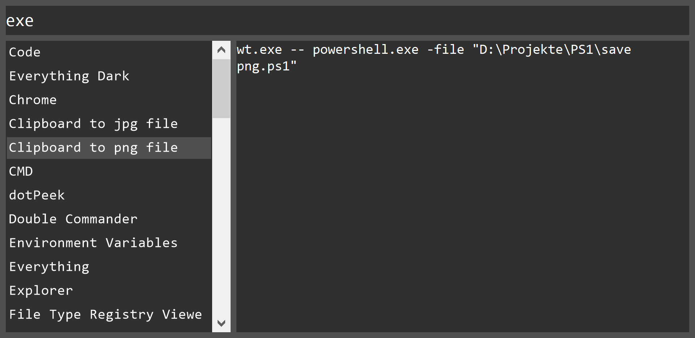

KeyLauncher
===========

KeyLauncher is a simple keyboard driven launcher application for Windows.

Main Features
-------------

- Launch applications
- Launch URLs
- Launch folders with File Explorer
- Store small bits of information

Description
-----------

Currently, hard-coded are theme colors and the shortcut to show KeyLauncher (Alt+Space), making this customizable settings depends on how successful KeyLauncher will be.

Unlike popular Launchers such as Wox launcher KeyLauncher does not search the system or anywhere else, it only uses items that were manually created within the application, the advantage of this approach is efficiency, cleanness and predictability.

After an extensive examination I came to the conclusion that classical launchers like the Windows start menu, Wox launcher and Ueli (Electron based resource hog) have too many shortcomings and simply too often don't work very well. But nothing speaks against using them side by side with KeyLauncher, I still have them installed and running in the background.

I search bookmarks within Chrome and do calculations in PowerShell using Windows Terminal and for Everything a have an own frontend, so I don't need a poor Launcher for this kind tasks.

For larger bits of information a classical note taking app like Notion or Google Keep should rather be used.

For private and account information I recommend BitWarden.

It makes sense to do everything exclusively with KeyLauncher and give up the Windows start menu entirely. It takes time to build a complete catalog but it's worth the effort.

For apps the Shift key can be pressed to start with admin rights.

For files the Ctrl key can be pressed to open the folder in File Explorer.

The logic to detect if the content is launchable is:

must be single line
contains `.exe` or `:\`
or starts with `shell:` or `http` or `ms-settings`
or ends with `.msc`

Files and folders can be added via drag & drop.

The list on the left side has a context menu showing most of the features and their shortcuts.

KeyLauncher analyzes the content, if it detects that the content is launchable then it will launch it (using shell-execute), otherwise copy it to the clipboard.

Pressing enter starts the launch process.

Search Priority
---------------

Search is performed in the following order:

1. Search multiple keywords in name
2. Search multiple keywords in content
3. Search uppercase characters, ff does find FireFox
4. Search at the start of the name
5. Search in name 
6. Search in content

Furthermore, items can be setup to have low, medium or high priority in order to tweak the find order, this functionality can be found in the context menu of the item list on the left side.

Download
--------

https://github.com/stax76/KeyLauncher/releases

Support
-------

https://github.com/stax76/KeyLauncher/issues

History
-------

I've developed this application 15 years ago and in addition to launching apps I also always had my passwords and notes saved in it.

Recently I decided to move my passwords and private information to BitWarden and my notes to Google Keep.

Finally, after 15 years I decided to release it as open source project and hope more people find it useful.

Links
-----

https://betanews.com/2015/06/19/windows-10-tips-settings-control-panel

https://www.tenforums.com/tutorials/78214-settings-pages-list-uri-shortcuts-windows-10-a.html

https://www.winhelponline.com/blog/shell-commands-to-access-the-special-folders

https://support.microsoft.com/de-ch/help/192806/how-to-run-control-panel-tools-by-typing-a-command

Examples
--------

Some of my content in anonymized form:

Amazon  
https://www.amazon.com

AppData Roaming  
C:\Users\JonDoe\AppData\Roaming

Apps  
ms-settings:appsfeatures

Autostart Folder  
"C:\Users\JonDoe\AppData\Roaming\Microsoft\Windows\Start Menu\Programs\Startup"

BitWarden Web  
https://vault.bitwarden.com

Chrome  
"C:\Program Files\Google\Chrome\Application\chrome.exe"

CMD  
cmd.exe

Code  
"C:\Program Files\Microsoft VS Code\Code.exe"

Deinstall  
C:\Windows\System32\appwiz.cpl

Documents  
C:\Users\JonDoe\OneDrive\Documents

Double Commander  
"C:\MyFiles\Software\Double Commander\doublecmd.exe"

C:\  
C:\

D:\  
D:\

E:\  
E:\

F:\  
F:\

G:\  
G:\

Environment Variables  
rundll32.exe sysdm.cpl,EditEnvironmentVariables

Everything  
"C:\Program Files\Everything\Everything.exe"

Everything Dark  
"C:\Program Files\Everything\EverythingFrontend.exe"

Explorer  
explorer.exe

FireFox  
"C:\Program Files\Mozilla Firefox\firefox.exe"

GitHub Desktop  
C:\Users\JonDoe\AppData\Local\GitHubDesktop\GitHubDesktop.exe

Gmail  
https://mail.google.com

Google  
https://www.google.de

Google Maps  
https://www.google.de/maps

Home  
C:\Users\JonDoe

input.conf  
"C:\Users\JonDoe\OneDrive\Settings\mpv.net\input.conf"

IrfanView  
C:\MyFiles\Software\Multimedia\IrfanView\i_view64.exe

JDownloader  
"C:\Users\JonDoe\AppData\Local\JDownloader 2.0\JDownloader2.exe"

Kalender  
https://calendar.google.com/calendar/r?tab=wc

Keep  
https://keep.google.com

Contacts  
https://contacts.google.com

Last system events  
wt.exe -- powershell.exe -nologo -noexit -command get-eventlog system | select -first 100

To Do  
https://keep.google.com/#NOTE/UrlOfTheToDoList

Macrium Reflect  
"C:\Program Files\Macrium\Reflect\Reflect.exe"

Mail  
jon.doe@gmail.com

Mail Microsoft  
jon.doe@live.com

MakeMKV  
"C:\Program Files (x86)\MakeMKV\makemkv.exe"

mkvtoolnix-gui  
C:\MyFiles\Software\Multimedia\mkvtoolnix\mkvtoolnix-gui.exe

mp3DirectCut  
C:\MyFiles\Software\Multimedia\mp3DirectCut\mp3DirectCut.exe

MPC-BE  
"C:\Program Files\MPC-BE x64\mpc-be64.exe"

MPC-HC  
"C:\Program Files\MPC-HC\mpc-hc64.exe"

mpv  
C:\MyFiles\Software\Multimedia\mpv\mpv.exe

mpv config folder  
C:\Users\JonDoe\AppData\Roaming\mpv

mpv.conf  
"C:\Users\JonDoe\OneDrive\Settings\mpv.net\mpv.conf"

mpv.net  
C:\MyProjects\mpv.net\mpv.net\bin\x64\mpvnet.exe

mpv.net beta builds  
https://github.com/stax76/mpv.net/blob/master/Manual.md#beta

mpv.net changelog  
C:\MyProjects\mpv.net\Changelog.md

mpv.net config folder  
"C:\Users\JonDoe\OneDrive\Settings\mpv.net"

mpv.net history  
"C:\Users\JonDoe\OneDrive\Settings\mpv.net\history.txt"

MusicBee  
"C:\Program Files (x86)\MusicBee\MusicBee.exe"

Netplwiz user login  
Netplwiz.exe

OneDrive  
C:\Users\JonDoe\OneDrive

OneDrive Web  
https://onedrive.live.com

paint.net  
"C:\Program Files\paint.net\PaintDotNet.exe"

Pictures  
C:\Users\JonDoe\OneDrive\Pictures

PowerShell  
powershell.exe

PowerShell 5 Profile  
C:\Users\JonDoe\Documents\WindowsPowerShell\profile.ps1

PowerShell 7 Profile  
C:\Users\JonDoe\Documents\PowerShell\profile.ps1

Process Explorer  
"C:\MyFiles\Software\Process Explorer\procexp64.exe"

Process Monitor  
"C:\MyFiles\Software\Process Monitor\Procmon64.exe"

Projects  
C:\MyProjects

PS1 Folder  
C:\MyProjects\PS1

Python  
wt.exe C:\Users\JonDoe\AppData\Local\Programs\Python\Python38\python.exe

Recycle Bin  
shell:RecycleBinFolder

Regedit  
Regedit.exe

Release StaxRip  
wt.exe -- powershell.exe -nologo -noexit -file C:\MyProjects\StaxRip\Release.ps1

Router Address  
http://192.168.0.1

Screenpresso  
C:\MyFiles\Software\Productivity\Screenpresso\Screenpresso.exe

Screenshots  
C:\Users\JonDoe\Pictures\Screenshots

Software  
C:\MySoftware

Spy++  
"C:\Program Files (x86)\Microsoft Visual Studio\2019\Community\Common7\Tools\spyxx_amd64.exe"

Start Menu  
"C:\ProgramData\Microsoft\Windows\Start Menu"

StaxRip  
C:\MyProjects\StaxRip\bin\StaxRip.exe

StaxRip 32-Bit  
C:\MyProjects\StaxRip\bin-x86\StaxRip.exe

Phone  
0163 000000000

Temp Files  
C:\Users\JonDoe\AppData\Local\Temp

Translator  
https://translate.google.de

TreeSize  
"C:\Program Files (x86)\JAM Software\TreeSize Free\TreeSizeFree.exe"

UNC Network Path  
\\localhost\c$\Users\JonDoe\Desktop

Uninstall  
C:\Windows\System32\appwiz.cpl

VB Folder  
C:\MyProjects\VB

VirtualDub2  
C:\MyFiles\Software\Multimedia\VirtualDub\VirtualDub64.exe

Visual Studio  
"C:\Program Files (x86)\Microsoft Visual Studio\2019\Community\Common7\IDE\devenv.exe"

Wallpaper  
C:\Users\JonDoe\OneDrive\Pictures\Wallpaper

Weather  
C:\Users\JonDoe\OneDrive\Other\Shortcuts\Weather.lnk

Windows Terminal  
wt.exe

YouTube  
https://www.youtube.com
